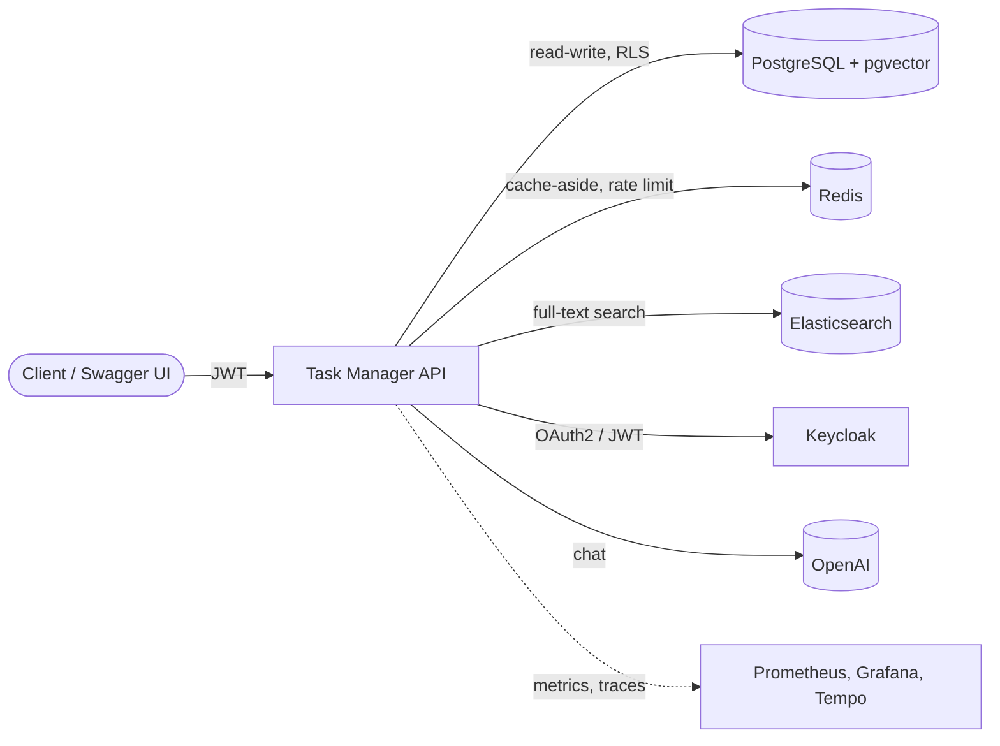
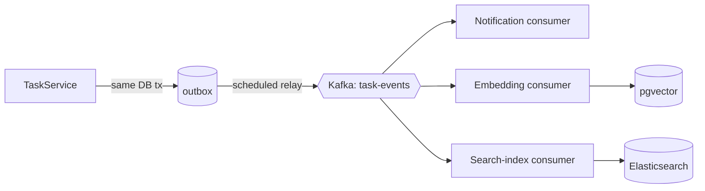
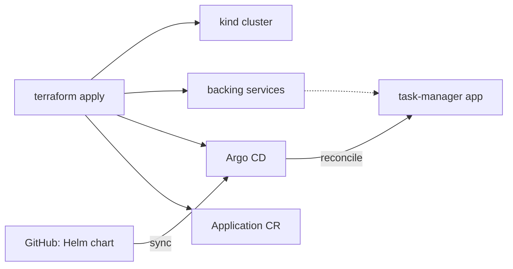
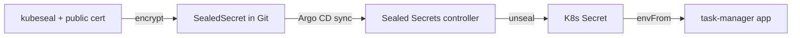

# 📋 Task Manager API

[](https://github.com/ghiwet/Task-Manager-API/actions/workflows/ci.yml)


> A production-shaped, event-driven task API — multi-tenant, observable, AI-enabled, and deployable from Docker to Kubernetes.

A Spring Boot (Java 25) REST API showcasing a modern backend stack: OAuth2/JWT security, PostgreSQL row-level multi-tenancy, a Kafka transactional outbox, Redis rate limiting + caching, Elasticsearch full-text search, a pgvector RAG assistant, end-to-end observability (metrics + tracing), and delivery via CI/CD, Helm, Terraform, and Argo CD (GitOps).

## 🗺️ Architecture

Request path and backing services:



Writes use a **transactional outbox** → Kafka → idempotent consumers that keep notifications, embeddings, and the search index in sync (no dual-write, no lost events):



---

## ✨ Highlights

- **API & auth** — versioned REST (`/api/v1`), OAuth2 login (Google / GitHub / Keycloak) + JWT resource server, per-user task ownership, admin two-tier delete, pagination, Swagger UI
- **Event-driven** — Kafka task events with a **transactional outbox** (atomic with the DB write, so none are lost) and a dead-letter topic
- **Data & search** — PostgreSQL + Flyway, **Redis cache-aside**, **Elasticsearch** full-text search, pgvector for semantic retrieval
- **Multi-tenancy & security** — tenant isolation via PostgreSQL **row-level security**, per-user rate limiting (Redis-backed, shared across replicas), security headers + input validation
- **AI** — **RAG assistant** over your tasks (Spring AI + pgvector), wrapped with Resilience4j (circuit breaker, retry, graceful fallback)
- **Observability** — Micrometer → Prometheus + Grafana, OpenTelemetry tracing → Tempo (one trace per request, across the Kafka boundary), **SLOs with multi-burn-rate alerting** (Alertmanager)
- **Delivery** — CI (build + test), CD (Docker image → GHCR on version tags, gated on the test suite), **layered security scanning** (CodeQL, Semgrep, OWASP Dependency-Check, TruffleHog, ZAP), **Helm** chart, **Terraform** provisioning the platform on kind, **Argo CD** delivering the app via GitOps, **Sealed Secrets** (no plaintext secrets in Git), Testcontainers integration tests

---

## 🎬 Demo

A full terminal walkthrough — real `curl` requests and responses (auth → create → full-text search →
AI assistant → custom metrics) — is in **[docs/demo.md](docs/demo.md)**.

---

## 🏗️ Tech Stack

- Java 25+
- Spring Boot 4.1
- Spring Framework 7
- Spring Security 7
- Spring Data JPA
- Flyway
- PostgreSQL
- Apache Kafka 4.3 (KRaft mode)
- Swagger (springdoc-openapi)
- Micrometer + Prometheus + Grafana
- OpenTelemetry (Micrometer Tracing) + Grafana Tempo (distributed tracing)
- Spring AI 2.0 (OpenAI chat, local ONNX embeddings, pgvector vector store)
- Resilience4j (circuit breaker, retry, timeout)
- Bucket4j (rate limiting)
- Testcontainers
- Docker and Docker Compose (PostgreSQL, Keycloak, Kafka, kafka-ui, Prometheus, Grafana, Tempo)

---

## 📁 Project Structure
```
├── src/main/java/com/example/taskmanager
│   ├── config       # Kafka, OpenAPI, cache configuration
│   ├── controller   # TaskController, UserController
│   ├── event        # TaskEvent + Kafka consumers (notification, DLT)
│   ├── outbox       # transactional outbox (entity, scheduled relay)
│   ├── model        # Task, AppUser (tenant-scoped via tenant_id)
│   ├── repository   # Spring Data JPA repositories
│   ├── service      # TaskService (business logic, cache-aside)
│   ├── security     # WebSecurityConfig, Redis-backed rate limiting
│   ├── tenant       # RLS multi-tenancy (context, filter, Hibernate)
│   ├── ai           # RAG assistant + embedding consumer (pgvector)
│   └── search       # Elasticsearch full-text search + index consumer
├── src/main/resources
│   ├── db/migrations        # Flyway SQL scripts
│   └── application.properties
├── src/test                 # integration tests (Testcontainers, EmbeddedKafka)
├── helm/task-manager        # Helm chart
├── terraform                # IaC: kind cluster + backing services + Argo CD + Sealed Secrets
├── argocd                   # Argo CD Applications + the encrypted SealedSecret (GitOps)
├── sealed-secrets/tls.crt   # public cert for kubeseal (controller private key is gitignored)
├── keycloak/realm-export.json
├── Dockerfile
├── docker-compose.yml
└── pom.xml
```

## 🌱 Branch Info

- **`main`** — the full application this README documents (OAuth2/JWT, multi-tenancy, Kafka outbox, Redis, Elasticsearch, AI assistant, observability, CI/CD, Helm, Terraform, Argo CD/GitOps)
- **`basic`** — a simpler variant using basic auth with JDBC users
- **`form`** — form login with a Thymeleaf login page
- **`terraform-deploy`** — the same application as `main`, but deployed by Terraform directly via a Helm release (push-based CD) instead of Argo CD/GitOps — a frozen snapshot of the pre-GitOps deployment approach

## 🔐 Registering OAuth2 Providers
To enable OAuth2 authentication using Google and GitHub, follow these steps to register your application on each provider.

### 📘 Register with GitHub

1. Go to [GitHub Developer Settings](https://github.com/settings/developers).
2. Click **New OAuth App**.
3. Fill in the form:

   - Application name: `Task Manager API`
   - Homepage URL: `http://localhost:8080`
   - Authorization callback URL: `http://localhost:8080/login/oauth2/code/github`

4. After saving, GitHub will provide:` Client ID` and `Client Secret`
5. Add these to the application.properties

###  📗 Register with Google

1. Go to [Google Cloud Console](https://console.cloud.google.com/).
2. Create a project or select an existing one.
3. Navigate to **APIs & Services → Credentials.**
4. Click **"Create Credentials" → OAuth client ID.**
5. Choose **Web application**.
6. Fill in:
   - Name: `Task Manager API`
   - Authorized JavaScript origins: ` http://localhost:8080`
   - Authorized redirect URIs: `http://localhost:8080/login/oauth2/code/google`
7. Click **Create** to get: `Client ID` and `Client Secret`
8. Add these to the `application.properties`
 ### 🔐 OAuth2 Setup
Keycloak works out of the box with `docker-compose up -d` (no extra config needed).

To enable GitHub and Google OAuth2, set the environment variables and activate the `oauth2` profile:
```bash
export GITHUB_CLIENT_ID=your-id
export GITHUB_CLIENT_SECRET=your-secret
export GOOGLE_CLIENT_ID=your-id
export GOOGLE_CLIENT_SECRET=your-secret

./mvnw spring-boot:run -Dspring-boot.run.profiles=oauth2
```
The GitHub/Google registration config lives in `application-oauth2.properties`.

## 🚦 Getting Started

### 🐳 Run Docker-Compose (PostgreSQL, Keycloak, Kafka, kafka-ui, Prometheus, Grafana, Tempo)

`docker-compose up -d`

###  ▶️ Run Application
`./mvnw spring-boot:run`

For the AI assistant's generation step, set an OpenAI key first (everything else runs without it):
```bash
export OPENAI_API_KEY=sk-...
```

### 🔄 CI/CD
GitHub Actions runs the build + full test suite on every push and PR (`ci.yml`). Pushing a version tag
publishes a container image to GitHub Container Registry (`release.yml`):
```bash
git tag v1.0.1 && git push origin v1.0.1   # → ghcr.io/ghiwet/task-manager-api:1.0.1 (+ :latest)
```

### 🔒 Security Scanning (CI)
A layered security workflow (`security.yml`, manually triggered via `workflow_dispatch`) runs:

| Tool | Type | Checks |
|------|------|--------|
| **CodeQL** | SAST | static analysis of the Java code |
| **Semgrep** | SAST | rule-based scanning (`p/ci` ruleset) |
| **OWASP Dependency-Check** | SCA | known-vulnerable dependencies |
| **TruffleHog** | Secrets | leaked credentials across the repo |
| **OWASP ZAP** | DAST | baseline scan against the running app |

### ☸️ Kubernetes (Helm)
A Helm chart lives in `helm/task-manager` — it deploys the app (pulling the GHCR image) and expects
Postgres (with the `vector` extension), Kafka, Redis, Elasticsearch, and Keycloak to be reachable; set their addresses in
`values.yaml` under `config.*`.
```bash
helm install tm helm/task-manager \
  --set image.tag=1.0.1 \
  --set secrets.openaiApiKey=$OPENAI_API_KEY   # supply real secrets via --set or a private values file
```
The Deployment has actuator startup/readiness/liveness probes and resource limits. Optional extras:
`--set autoscaling.enabled=true` (CPU-based HPA) and `--set ingress.enabled=true --set ingress.host=...`.
Validate without a cluster: `helm lint helm/task-manager` and `helm template tm helm/task-manager`.

**Try it locally with [kind](https://kind.sigs.k8s.io/):** build the image, load it into the cluster,
and point the chart at the backing services from `docker compose up -d` (reachable at your host IP).
```bash
kind create cluster --name tm
./mvnw package -DskipTests && docker build -t task-manager:local .
kind load docker-image task-manager:local --name tm

HOST_IP=$(ipconfig getifaddr en0)   # macOS; use `hostname -I` on Linux
helm install tm helm/task-manager --set image.repository=task-manager --set image.tag=local --set image.pullPolicy=Never --set config.datasourceUrl=jdbc:postgresql://$HOST_IP:5433/taskdb --set config.kafkaBootstrapServers=$HOST_IP:29092 --set config.keycloakBaseUrl=http://$HOST_IP:8082

kubectl get pods -w                                  # wait for 1/1 Ready
kubectl port-forward svc/tm-task-manager 8080:8080
curl http://localhost:8080/actuator/health           # {"status":"UP"}

helm uninstall tm && kind delete cluster --name tm   # cleanup
```
> Kafka is degraded in this setup (the compose broker advertises `localhost`, unreachable across the
> kind/compose network boundary) — harmless here; run Kafka in-cluster for full connectivity.

### 🏗️ Provision with Terraform
`terraform/` provisions the **platform** as code — a kind cluster, the backing services
(Postgres/Redis/Kafka/Elasticsearch/Keycloak) **in-cluster**, and **Argo CD** — as reusable modules
(`cluster`, `backing-services`, `argocd`) composed by a root config. The app itself is *not* deployed by
Terraform; Argo CD delivers it (see below). Kafka is advertised as its in-cluster service, so it connects
fully (unlike the compose+kind setup above).

Run it in three steps — the local image is loaded **after** the cluster exists so the app's pods find it
without pulling from GHCR:
```bash
cd terraform
terraform init

# 1. create just the cluster
terraform apply -auto-approve -target=module.cluster

# 2. build the image under the tag the Argo CD Application pins, and load it into the cluster
(cd .. && ./mvnw package -DskipTests && docker build -t ghcr.io/ghiwet/task-manager-api:1.0.1 .)
kind load docker-image ghcr.io/ghiwet/task-manager-api:1.0.1 --name task-manager

# 3. bring up the backing services + Argo CD, which then syncs the app from Git
terraform apply -auto-approve

# apply returns once the Argo CD Application is created; the app is synced asynchronously, so
# wait for it before reaching in (Argo CD — not the terraform exit code — owns app health)
kubectl -n argocd wait --for=jsonpath='{.status.health.status}'=Healthy application/task-manager --timeout=5m

# reach it (the command is also printed as the `app_port_forward` output)
kubectl -n task-manager port-forward svc/task-manager-task-manager 8080:8080
curl http://localhost:8080/actuator/health          # {"status":"UP"}

# tear it all down (cluster included)
terraform destroy -auto-approve
```
Skip the build/load step to have Argo CD pull the released `ghcr.io/ghiwet/task-manager-api` image from
GHCR instead (the package must be public, or supply an image pull secret).

### 🚀 GitOps Delivery (Argo CD)
Terraform bootstraps Argo CD (push); from there Argo CD delivers the app (pull). The
`argocd/applications/task-manager.yaml` **Application** points at the Helm chart in this repo and syncs it
with **automated prune + self-heal** — the cluster continuously converges on Git, and manual drift (a
deleted Deployment, an edited replica count) is reverted within seconds. Releasing a version is just
bumping `image.tag` in that Application and pushing.



Open the Argo CD UI to watch it sync:
```bash
kubectl -n argocd port-forward svc/argocd-server 8083:80    # then http://localhost:8083
# user: admin — initial password:
kubectl -n argocd get secret argocd-initial-admin-secret -o jsonpath='{.data.password}' | base64 -d
```

### 🔐 Secrets (Sealed Secrets)
Real secrets are never committed in plaintext. In the GitOps flow the Argo CD Application sets the
chart's `secrets.create=false` (no plaintext Secret); the app's Secret comes instead from a committed,
**encrypted SealedSecret** (`argocd/secrets/`). Terraform installs the Sealed Secrets controller and
seeds it a **fixed keypair** (private key gitignored, public cert committed), so committed SealedSecrets
decrypt reproducibly even after the cluster is recreated. The app's Argo CD Application is **multi-source**
— it syncs the SealedSecret and the chart together, with the SealedSecret in an earlier **sync-wave** so
the controller unseals it into the app's Secret before the pods that consume it (via `envFrom`) start.



Re-seal after changing a value (offline, against the committed cert):
```bash
kubectl create secret generic task-manager-task-manager-secret -n task-manager \
  --from-literal=SPRING_DATASOURCE_PASSWORD=... \
  --from-literal=KEYCLOAK_CLIENT_SECRET=... \
  --dry-run=client -o yaml \
  | kubeseal --cert sealed-secrets/tls.crt --format yaml \
  > argocd/secrets/task-manager-sealedsecret.yaml
```
> `sealed-secrets/tls.key` (the controller's private key) is gitignored; only the public cert is
> committed. Clone without the key and the committed SealedSecret can't be decrypted — generate your
> own key and re-seal.

### 🧪 Running Tests
`./mvnw test`

Tests use Testcontainers (PostgreSQL) and EmbeddedKafka — no external services needed.

### 📑 Swagger Documentation
`http://localhost:8080/swagger-ui/index.html`

### 📊 Kafka UI
`http://localhost:8083`

### 📈 Prometheus
`http://localhost:9090`

### 📉 Grafana
`http://localhost:3000` (admin/admin) — pre-provisioned dashboard with JVM, HTTP, task operations, Kafka events, and DB pool metrics. Traces are in **Explore → Tempo**.

### 🔭 Tempo (traces)
`http://localhost:3200` (queried through Grafana; spans are sent here via OTLP on `:4318`)

> Upgrading an existing stack? The Grafana datasources are provisioned with fixed UIDs. If you ran an
> earlier version, recreate the Grafana volume once (`docker compose down -v`, or remove the
> `grafana_data` volume) so the new UIDs provision cleanly.

## 🛡️ Security Hardening

### 🚦 Rate Limiting

Requests are throttled with [Bucket4j](https://bucket4j.com/) token buckets via a `RateLimitFilter` placed
just after JWT authentication in the security chain. Authenticated requests are keyed per JWT subject; anonymous
requests fall back to the client IP (`X-Forwarded-For` aware). Each response carries an `X-Rate-Limit-Remaining`
header; exceeded limits return `429 Too Many Requests` with a `Retry-After` header and an RFC 9457 `ProblemDetail`
body, and increment the `rate_limit_exceeded_total` Prometheus counter.

Buckets live in **Redis** (Bucket4j's Lettuce proxy manager), so the limit is **shared across replicas** —
an in-memory map would let N pods each grant the full limit. If Redis is unavailable the filter **fails open**
(logs and allows the request) rather than blocking traffic, and bucket TTLs replace any cleanup job.

Limits are configurable in `application.properties`:

```properties
rate-limit.enabled=true
rate-limit.public-requests-per-minute=20          # keyed by IP
rate-limit.authenticated-requests-per-minute=60   # keyed by JWT subject
rate-limit.registration-requests-per-minute=5     # stricter, for /api/v1/users/register
```

### ⚡ Caching

Task lookups use **cache-aside** with Spring Cache over Redis: `findTask` is `@Cacheable` (keyed by
`owner:id`), and updates/deletes `@CacheEvict` the entry so reads never go stale. TTL is configurable
(`cache.tasks.ttl-minutes`), and the cache **fails open** — a Redis outage falls through to the database
instead of erroring.

### 🔍 Full-text Search

`GET /api/v1/tasks/search?q=…&completed=…` runs a keyword search over task title/description in
**Elasticsearch**, with match **highlighting** and pagination. Results are always **scoped to the
caller's owner and tenant** (Elasticsearch has no row-level security, so isolation is enforced in the
query, mirroring the AI retriever). The index is kept in sync **event-driven** off the Kafka task
stream — `TaskSearchIndexConsumer` upserts/deletes by id (no dual-write, like the embedding consumer)
— so search is a rebuildable derived view. Indexing and querying are **best-effort**: if Elasticsearch
is unavailable the app still runs and search returns empty rather than erroring. This is distinct from
the AI assistant's **semantic** search (pgvector) — keyword/faceted vs. meaning-based.

### 🔒 Security Headers

Every response sets defensive HTTP headers via the Spring Security `headers()` DSL:

- `Strict-Transport-Security` (1 year, includeSubDomains, preload) — emitted over HTTPS
- `X-Content-Type-Options: nosniff`
- `X-Frame-Options: DENY`
- `Content-Security-Policy: default-src 'self'; ...`
- `Referrer-Policy: strict-origin-when-cross-origin`
- `Permissions-Policy: camera=(), microphone=(), geolocation=()`

### ✅ Input Validation

Registration binds a dedicated `UserRegistrationDto` (not the raw entity), preventing mass-assignment of `id`,
`version`, or `roles`. Constraints are enforced with Jakarta Bean Validation:

- **username** — 3–50 chars, letters/digits/`. _ -` only
- **password** — 8–128 chars, requiring upper- and lower-case letters, a digit, and a special character

Validation failures return `400 Bad Request` with a per-field `errors` map; duplicate usernames return `409 Conflict`.

## 🏢 Multi-Tenancy (Row-Level Security)

Tasks and users are scoped to a tenant via a `tenant_id` column, and isolation is enforced by **PostgreSQL
row-level security** — at the database layer, not just in application code. Even a query that forgets its
`WHERE` clause (or a future bug) physically cannot return another tenant's rows.

**How a request's tenant reaches the database:**

```
JWT  tenant_id claim
  → TenantFilter            (reads the claim, binds it to a request-scoped TenantContext)
  → CurrentTenantResolver   (Hibernate asks "which tenant?" per unit of work)
  → TenantConnectionProvider(runs set_config('app.current_tenant', …) on the pooled connection,
                             and resets it on release so nothing leaks across requests)
  → RLS policy              (USING / WITH CHECK: tenant_id = current_setting('app.current_tenant'))
```

The tenant comes from a custom `tenant_id` claim, added in Keycloak via a user attribute and a protocol
mapper (see `keycloak/realm-export.json`). `current_setting('app.current_tenant', true)` returns `NULL`
when unset, so a missing tenant context matches **no rows** (default deny) rather than erroring.

**Two database roles** make this airtight (RLS does not apply to a table's owner or a superuser):

| Role | Used by | Privilege | RLS |
|------|---------|-----------|-----|
| `app_rls` | the application at runtime | non-owner, DML only | **enforced** |
| `taskuser` | Flyway migrations | owner / superuser | bypassed (so migrations run) |

The app connects as the least-privilege `app_rls` role (`spring.datasource.*`), while Flyway connects as the
privileged owner (`spring.flyway.user`). The `app_rls` role, its grants, and the policies are created in the
`V5__enable_rls.sql` migration.

`TenantIsolationTest` connects the app as `app_rls` and proves isolation holds — including cases where the
same owner exists in two tenants, so only RLS (not the owner filter) can block cross-tenant access.

## 🔭 Distributed Tracing

Requests are traced with the **Micrometer Observation API** bridged to **OpenTelemetry**, exporting spans
over **OTLP/HTTP** to **Grafana Tempo**. A single request becomes one trace that follows the work across
every layer — and across the Kafka boundary:

```
HTTP POST /api/v1/tasks  (server span)
  ├── Spring Security  (filter chain, authn, authz)
  ├── JDBC             (connection, query, generated-keys)
  ├── task-events send     (Kafka producer span)
  └── task-events process  (Kafka consumer span — same trace via propagated context)
```

- **HTTP, RestClient, JDBC** spans are auto-instrumented; JDBC query spans come from
  [`datasource-micrometer`](https://github.com/jdbc-observations/datasource-micrometer).
- **Kafka propagation** is enabled by observation on the producer template and listener container
  (`spring.kafka.template.observation-enabled` / `spring.kafka.listener.observation-enabled`), so the
  consumer span joins the producer's trace via W3C `traceparent` headers.
- **Log correlation** — every log line includes `traceId`/`spanId`, and Grafana's Tempo datasource links
  spans back to Prometheus metrics for the same service.

Configurable in `application.properties`:

```properties
spring.application.name=task-manager-api
management.tracing.sampling.probability=1.0                                  # sample all in dev
management.opentelemetry.tracing.export.otlp.endpoint=http://localhost:4318/v1/traces
```

**View traces:** Grafana → Explore → **Tempo** datasource → search (e.g. `{ name = "http post /api/v1/tasks" }`).
Metrics stay on the Prometheus pipeline; only traces go to Tempo.

> Note: tracing is wired via `spring-boot-starter-opentelemetry`. The starter also brings an OTLP metrics
> registry, so metrics are kept on the Prometheus pipeline with `management.otlp.metrics.export.enabled=false`.

## 📊 SLOs & Alerting

Two SLOs are defined on the API from Spring Boot's `http_server_requests` metric, with alerting on
**error-budget burn rate** (the Google SRE approach) rather than raw error rate:

| SLO | Target | Error budget |
|-----|--------|--------------|
| **Availability** — non-5xx API responses | 99.5% | 0.5% |
| **Latency** — API requests < 300ms (excl. the assistant) | 95% | 5% |

`observability/prometheus/rules/slo.rules.yml` holds Prometheus **recording rules** (the SLIs over
5m/30m/1h/6h windows) and **multi-window, multi-burn-rate alerts**: a **page** on a fast burn (≥14.4×
over 1h *and* 5m — ~2% of the 30-day budget in an hour) and a **ticket** on a slow burn (≥6× over 6h
*and* 30m). The rules are unit-tested with `promtool test rules` (`*.test.yml`), so alert logic is
verified without waiting for real traffic:

```bash
docker run --rm --entrypoint promtool -v "$PWD/observability/prometheus/rules:/rules" \
  prom/prometheus:v3.4.1 test rules /rules/slo.rules.test.yml
```

**Alertmanager** (`:9093`) routes by `severity` (page/ticket) with an inhibit rule so a fast-burn page
suppresses the same SLO's slow-burn ticket; receivers are UI-only locally (wire Slack/PagerDuty for a
real environment). A provisioned **Grafana SLO dashboard** ("Task Manager — SLOs & Error Budgets") shows
the SLIs, 30-day error budget remaining, and burn-rate panels with the 6×/14.4× thresholds drawn in.

```bash
docker compose up -d prometheus alertmanager grafana
# Prometheus alerts → http://localhost:9090/alerts   ·   Alertmanager → http://localhost:9093
# Grafana SLO dashboard → http://localhost:3000  (admin/admin)
```

## 🤖 AI Task Assistant (RAG)

Ask natural-language questions about your tasks. `POST /api/v1/assistant/query` runs a retrieval-augmented
generation flow that reuses the rest of the stack:

```
question
  → embed (local ONNX model, all-MiniLM)
  → similarity search in pgvector, scoped to your tenant (RLS) AND your tasks (owner filter)
  → OpenAI answers using only the retrieved tasks as context
  → { answer, retrievedTaskIds }
```

- **Personal scoping** — retrieval is bounded by **tenant** (RLS, the same `SET LOCAL app.current_tenant`
  boundary as the rest of the app) *and* **owner** (a metadata filter), so the assistant only ever sees
  what you can see through the task API. A colleague's tasks in the same tenant are never retrieved.
- **Event-driven indexing** — task embeddings are kept in sync off the Kafka task event stream (a
  dedicated consumer group upserts on create/update, removes on delete); no embedding API is used.
- **Cost controls** — the endpoint has its own stricter rate-limit bucket (`assistant-requests-per-minute`),
  separate from the general per-user limit.
- **Resilience** — the OpenAI call is wrapped with Resilience4j: **retry** on transient errors (rate limit,
  5xx, IO — never on 4xx), a **circuit breaker** that opens on sustained failures (auth/4xx don't trip it),
  a read **timeout**, and a **fallback** that returns a degraded message with the retrieved task ids. A
  failing or slow model degrades gracefully to a `200` instead of a `500`. Circuit-breaker/retry state is on
  Prometheus (`resilience4j_circuitbreaker_state`, `resilience4j_retry_calls_total`).
- **Observability** — the whole flow is one trace (HTTP → `embedding` → `pg_vector query` → `chat`), and
  Spring AI exports Prometheus metrics: `gen_ai_client_operation_seconds` (chat/embedding latency, tagged by
  model/system) and `gen_ai_client_token_usage_total` (token cost, tagged `gen_ai_token_type=input|output|total`).
  Example token-cost query: `sum by (gen_ai_token_type) (rate(gen_ai_client_token_usage_total{gen_ai_system="openai"}[5m]))`.

Configure in `application.properties` (chat via OpenAI, embeddings local, store managed by Flyway `V6`):

```properties
spring.ai.model.chat=openai
spring.ai.model.embedding=transformers       # local ONNX; no embedding API
spring.ai.openai.api-key=${OPENAI_API_KEY:}
spring.ai.openai.chat.options.model=gpt-4o-mini
spring.ai.vectorstore.pgvector.initialize-schema=false   # the table + RLS come from Flyway
```

> Requires `OPENAI_API_KEY` for the generation step. Embeddings, retrieval, and tenant/owner scoping work
> without it; only the final answer needs the key.

## 📤 Transactional Outbox

Task events aren't sent to Kafka directly (a best-effort send can be lost if the broker is momentarily
down — and here that would mean a task never gets embedded). Instead they use the **outbox pattern**:

```
TaskService.<create|update|delete>  (@Transactional)
  ├── task change      ┐ one atomic DB transaction — both commit, or neither
  └── outbox row       ┘
OutboxRelay  (@Scheduled)  claim unpublished rows (FOR UPDATE SKIP LOCKED) → send to Kafka → mark published
```

- **No lost events** — the event is durably staged with the task change; if Kafka is down the row stays
  unpublished and the relay retries on the next poll (verified by stopping Kafka, creating a task, and
  watching it publish on recovery).
- **Safe concurrent relaying** — `FOR UPDATE SKIP LOCKED` lets multiple instances relay without double-publishing.
- **At-least-once** — a crash between send and mark-published may redeliver; consumers are idempotent
  (embedding upsert/delete by deterministic id), so that's safe.
- Published rows are pruned by a scheduled cleanup; `outbox_published_total` / `outbox_publish_failed_total`
  are exposed to Prometheus.

## 🔗 API Endpoints
### 🔨 Task Endpoints
```
GET    /api/v1/tasks           — list own tasks (paginated: ?page=0&size=20)

POST   /api/v1/tasks           — create task (assigned to authenticated user)

GET    /api/v1/tasks/{id}      — get own task by ID

PUT    /api/v1/tasks/{id}      — update own task

DELETE /api/v1/tasks/{id}      — delete own task (ROLE_USER) or any task in the tenant (ROLE_ADMIN)
```

### 👤 User Endpoints
```
POST /api/v1/users/register — register user (validated username + password)

GET /api/v1/users/me — current user info (secured)
```

### 🤖 Assistant Endpoint
```
POST /api/v1/assistant/query — ask about your tasks (ROLE_USER); body {"question": "..."}
                            returns {"answer": "...", "retrievedTaskIds": [..]}
```
